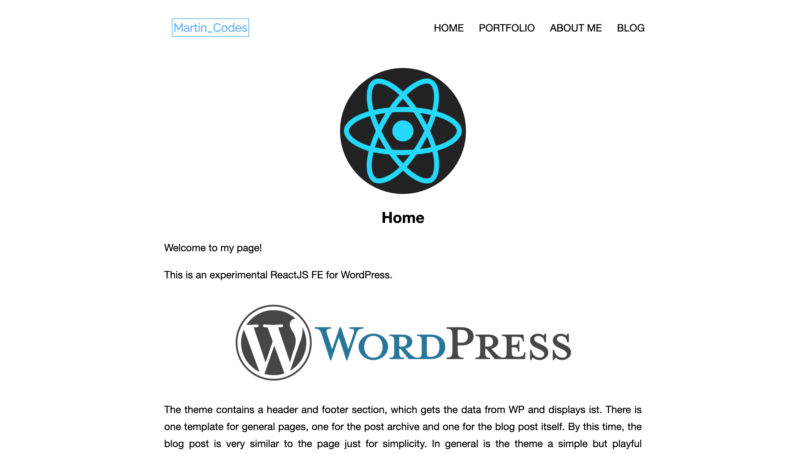
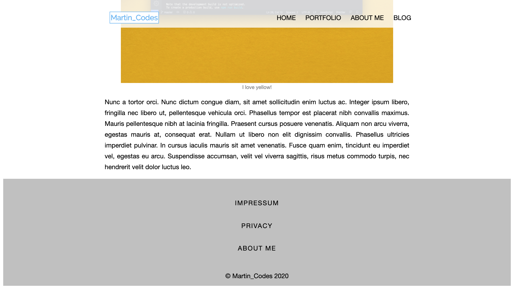
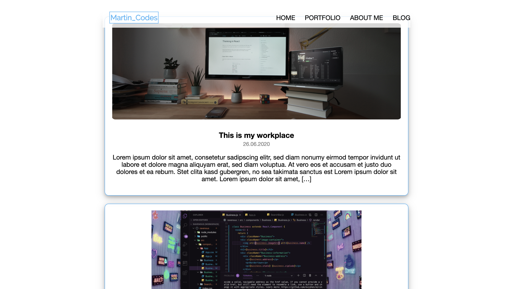

## Table of contents
* [Generell](#generell)
* [Pitfalls](#pitfalls)
* [Screenshots](#screenshots)
* [Extend the WP API via Theme](#extent-the-wp-api-via-theme)

---

## Generell
This is a simple ReactJS Frontend for the Wordpress REST API. This theme is by now just an experimental approach! 
It fetches the header and footer menu from the API as well as the pages and posts. The posts are displayed first in a post archive. The theme in generall is very simple but somehow playful in the design.

---

## Pitfalls
Because that's just an experimental approach, there are some things you need to know:
- the Logo is by now a hard coded fetch to the belonging image in my local WP
- the start page has to be named "Home" in order to work, the theme is not fetching for the belonging setting but just for the slug
- the theme supports some Gutenberg blocks such as images, columns, lists, paragraphs, and headings. If you want to use other blocks you have to add the stylingin order to show them probably

---

## Screenshots



---


---


---

## Extend the WP API via Theme
In order to let the fetching of the menu items (header and footer) work, you need to add this function to your theme's function.php file.

```
add_filter('register_post_type_args', function ($args, $post_type) {
    if ($post_type == 'nav_menu_item' &&
        class_exists('WP_REST_Posts_Controller') &&
        !class_exists('WP_REST_NavMenuItem_Controller')) {

        class WP_REST_NavMenuItem_Controller extends WP_REST_Posts_Controller {
            public function get_items( $request ) {
                $args = wp_parse_args($request, [
                    'order' => 'ASC',
                    'orderby' => 'menu_order',
                ]);

				$output = [];
				
				$locations = get_nav_menu_locations();
					

            	foreach ( $locations as $location => $id) {

				$menu      = wp_get_nav_menu_object( $id );
				$items = $menu ? wp_get_nav_menu_items( $menu->term_id ) : [];
                 // $items = wp_get_nav_menu_items($location, $args);
                $output["$location"] = $items;
				}

                return rest_ensure_response(empty($request['location']) ? $output : $output[$request['location']]);
            }

            public function get_collection_params() {
                $query_params = parent::get_collection_params();
                $query_params['menu'] = [
                    'description' => __( 'primary' ),
                    'type' => 'string',
                ];
                return $query_params;
            }
        }

        // Alter the post type arguments
        $args['show_in_rest'] = true;
        $args['rest_controller_class'] = 'WP_REST_NavMenuItem_Controller';
    }
    return $args;
}, 10, 2);

```


Also be aware of the names of the menu's location in the theme you're using. They can differ from theme to theme (eg primary or menu-1 or so on).

---

This project was bootstrapped with [Create React App](https://github.com/facebook/create-react-app).

## Available Scripts

In the project directory, you can run:

### `npm start`

Runs the app in the development mode.<br />
Open [http://localhost:3000](http://localhost:3000) to view it in the browser.

The page will reload if you make edits.<br />
You will also see any lint errors in the console.

### `npm test`

Launches the test runner in the interactive watch mode.<br />
See the section about [running tests](https://facebook.github.io/create-react-app/docs/running-tests) for more information.

### `npm run build`

Builds the app for production to the `build` folder.<br />
It correctly bundles React in production mode and optimizes the build for the best performance.

The build is minified and the filenames include the hashes.<br />
Your app is ready to be deployed!

See the section about [deployment](https://facebook.github.io/create-react-app/docs/deployment) for more information.

### `npm run eject`

**Note: this is a one-way operation. Once you `eject`, you can’t go back!**

If you aren’t satisfied with the build tool and configuration choices, you can `eject` at any time. This command will remove the single build dependency from your project.

Instead, it will copy all the configuration files and the transitive dependencies (webpack, Babel, ESLint, etc) right into your project so you have full control over them. All of the commands except `eject` will still work, but they will point to the copied scripts so you can tweak them. At this point you’re on your own.

You don’t have to ever use `eject`. The curated feature set is suitable for small and middle deployments, and you shouldn’t feel obligated to use this feature. However we understand that this tool wouldn’t be useful if you couldn’t customize it when you are ready for it.

## Learn More

You can learn more in the [Create React App documentation](https://facebook.github.io/create-react-app/docs/getting-started).

To learn React, check out the [React documentation](https://reactjs.org/).

### Code Splitting

This section has moved here: https://facebook.github.io/create-react-app/docs/code-splitting

### Analyzing the Bundle Size

This section has moved here: https://facebook.github.io/create-react-app/docs/analyzing-the-bundle-size

### Making a Progressive Web App

This section has moved here: https://facebook.github.io/create-react-app/docs/making-a-progressive-web-app

### Advanced Configuration

This section has moved here: https://facebook.github.io/create-react-app/docs/advanced-configuration

### Deployment

This section has moved here: https://facebook.github.io/create-react-app/docs/deployment

### `npm run build` fails to minify

This section has moved here: https://facebook.github.io/create-react-app/docs/troubleshooting#npm-run-build-fails-to-minify
